# 🔄 System Flow Charts

## 📋 Table of Contents

1. [User Interaction Flow](#user-interaction-flow)
2. [Health Assessment Process](#health-assessment-process)
3. [AI Response Generation](#ai-response-generation)
4. [Session Management](#session-management)
5. [Error Handling & Recovery](#error-handling--recovery)
6. [Data Processing Pipeline](#data-processing-pipeline)

---

## 🔄 User Interaction Flow

### Main User Journey

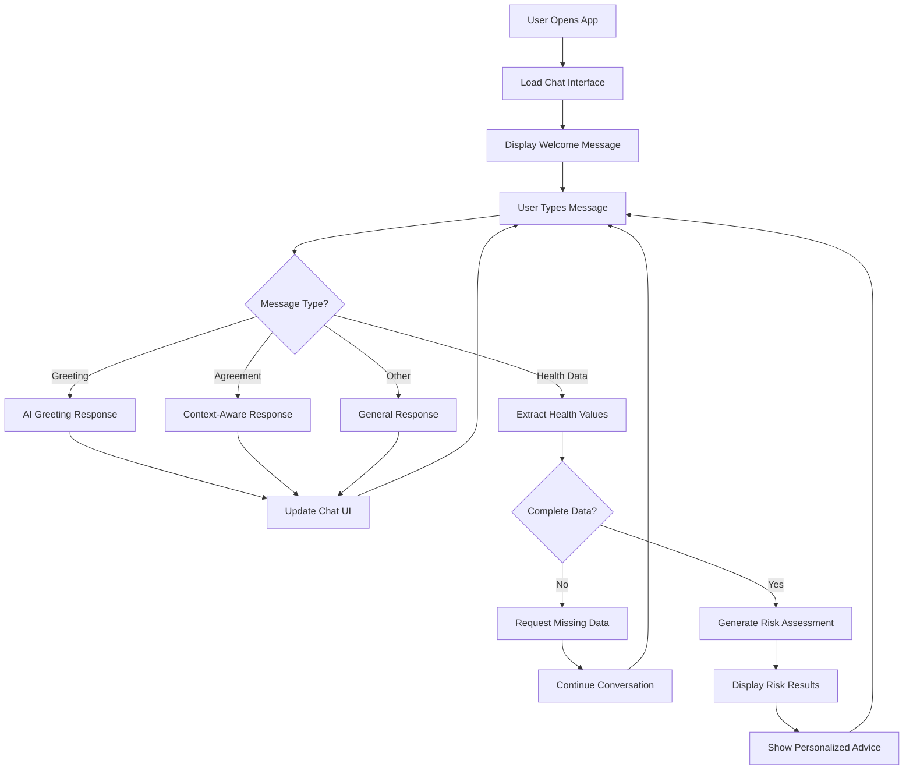

### Detailed Message Processing

```mermaid
graph LR
    A[User Input] --> B[Frontend Validation]
    B --> C[Format Check]
    C --> D[API Request]
    D --> E[Backend Processing]
    E --> F[Response Generation]
    F --> G[UI Update]
    
    subgraph "Frontend"
        B --> B1[Empty Check]
        B1 --> B2[Character Limit]
        B2 --> C
    end
    
    subgraph "Backend"
        E --> E1[Session Management]
        E1 --> E2[Health Extraction]
        E2 --> E3[AI Processing]
        E3 --> F
    end
    
    subgraph "Response"
        F --> F1[AI Response]
        F1 --> F2[Risk Assessment]
        F2 --> F3[Error Handling]
        F3 --> G
    end
```

---

## 🏥 Health Assessment Process

### Risk Calculation Flow

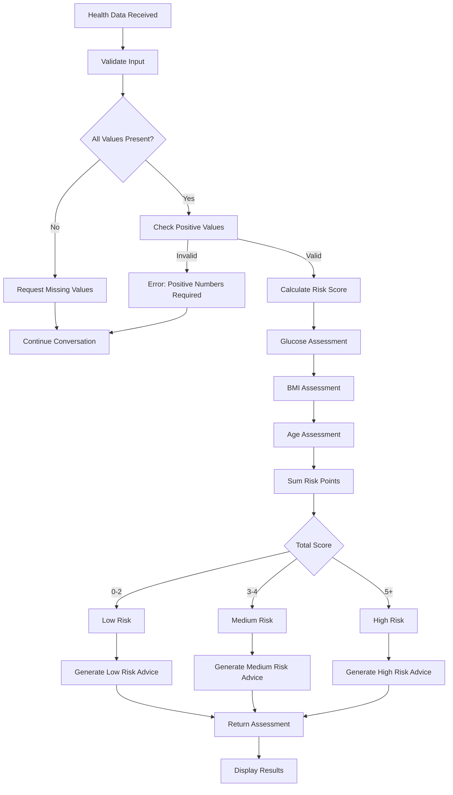

### Medical Guidelines Implementation

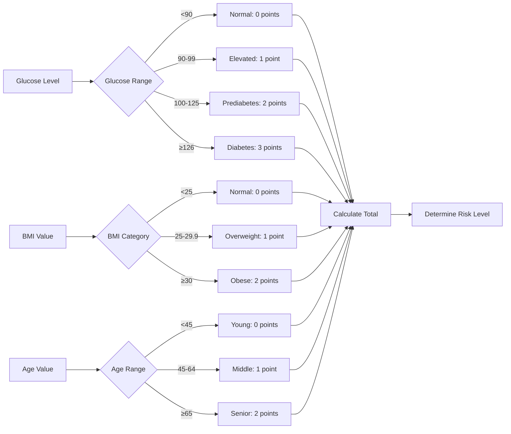

---

## 🤖 AI Response Generation

### Dynamic Response Flow

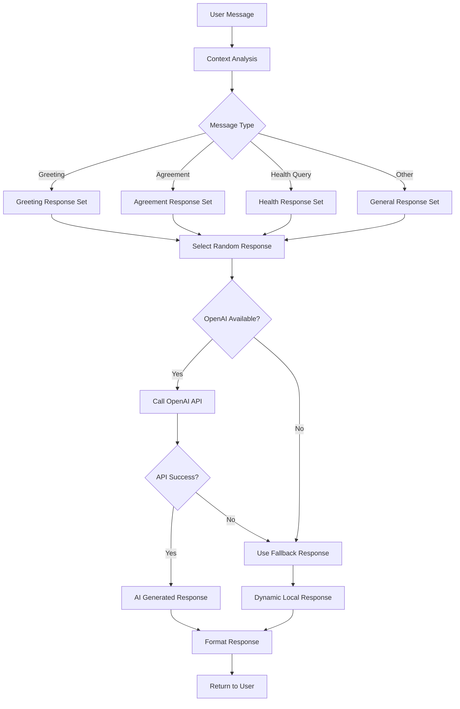

### OpenAI Integration Flow

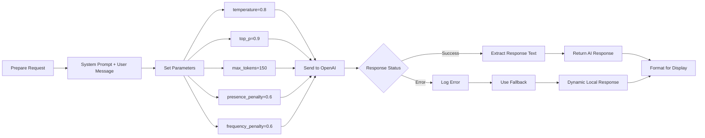

---

## 📝 Session Management

### Session Lifecycle

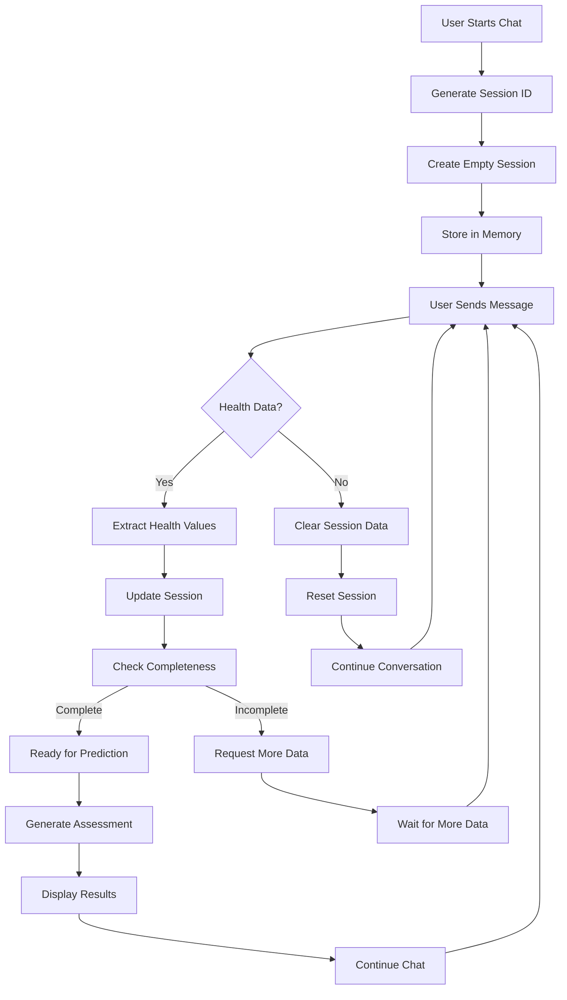

### Session Data Structure

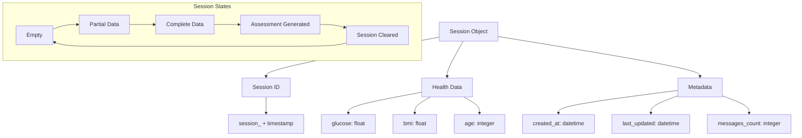

---

## ⚠️ Error Handling & Recovery

### Comprehensive Error Flow

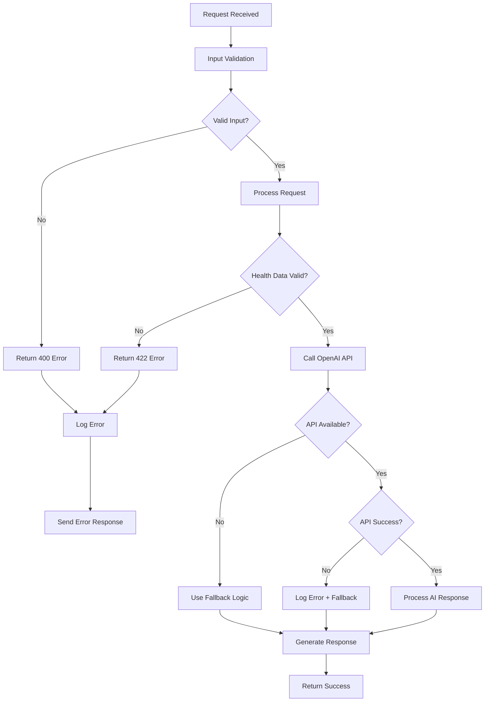

### SSL Certificate Error Handling

```mermaid
graph LR
    A[API Call Attempt] --> B{SSL Error?}
    
    B -->|No| C[Normal Processing]
    B -->|Yes| D[Apply SSL Fix]
    
    D --> E[ssl._create_unverified_https_context]
    E --> F[httpx.Client(verify=False)]
    F --> G[Retry API Call]
    
    G --> H{Success?}
    
    H -->|Yes| I[Continue Processing]
    H -->|No| J[Use Fallback]
    
    C --> K[Return Response]
    I --> K
    J --> L[Dynamic Local Response]
    L --> K
```

---

## 🔄 Data Processing Pipeline

### Health Data Extraction Pipeline

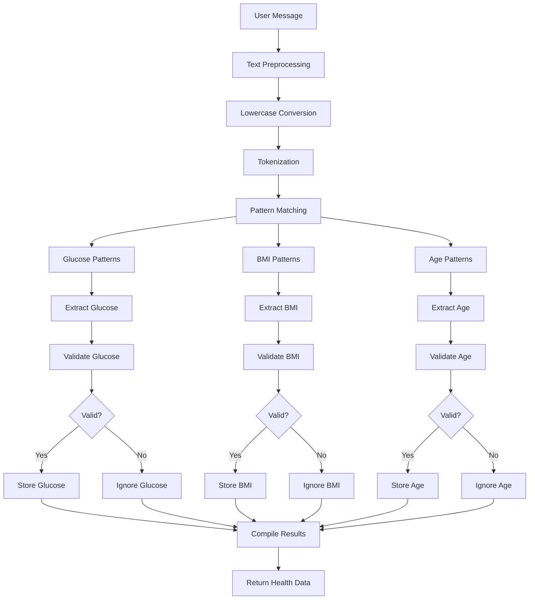

### Response Generation Pipeline

```mermaid
graph LR
    A[Response Request] --> B[Context Analysis]
    B --> C[Message Classification]
    
    C --> D[Response Strategy]
    D --> E{AI Available?}
    
    E -->|Yes| F[OpenAI Processing]
    E -->|No| G[Fallback Processing]
    
    F --> H[Prompt Engineering]
    H --> I[Parameter Tuning]
    I --> J[API Call]
    
    G --> K[Pattern Matching]
    K --> L[Response Selection]
    L --> M[Randomization]
    
    J --> N{Success?}
    N -->|Yes| O[AI Response]
    N -->|No| G
    
    M --> P[Dynamic Response]
    O --> Q[Response Formatting]
    P --> Q
    
    Q --> R[Final Response]
```

---

## 📊 System Metrics & Monitoring

### Performance Monitoring Flow

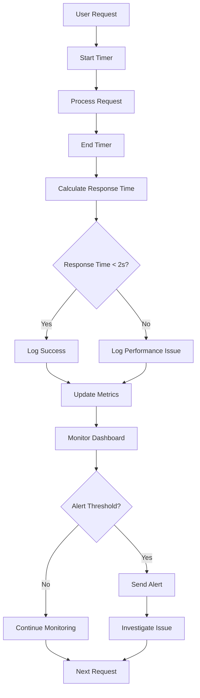

### Error Rate Monitoring

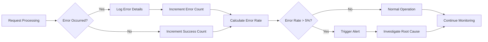

---

## 🔧 Configuration & Deployment Flow

### Environment Setup Flow

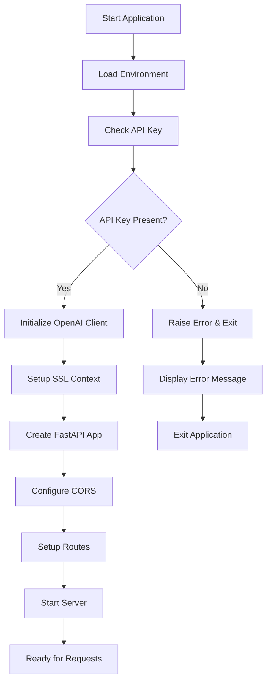

### Vercel Deployment Flow

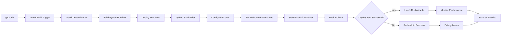

---

*These flow charts provide comprehensive visual documentation of all system processes, from user interactions to technical implementations.*
